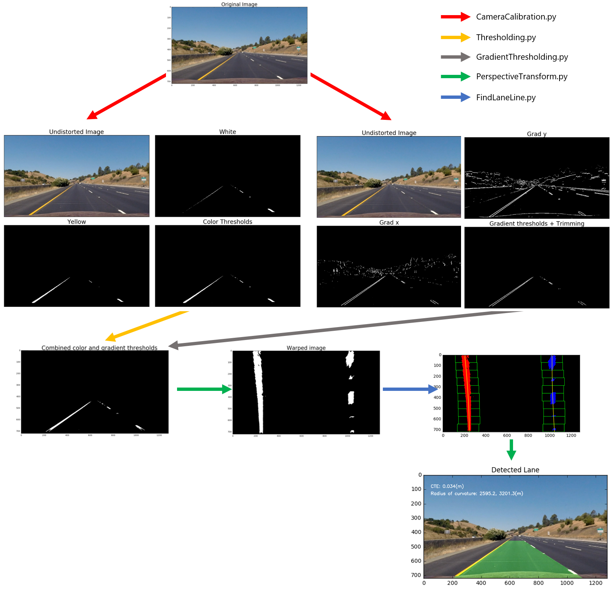

## Advanced Lane Finding

In this project, the goal is to write a software pipeline to identify the lane boundaries in a video.

Pipeline with one example image
---
You can find all the detail of advanced lane line detection pipeline on [`pipeline.ipynb`](./pipeline.ipynb). (**first try**)

The **updated** version [`pipeline-ColorFilterHeavy.ipynb`](./pipeline-ColorFilterHeavy.ipynb) is available. All processes are the same except for color thresholding part. I updated color thresholding logic considering additional **RGB** channel.

The algorithm consists of:
* Camera Calibration
* Thresholding
    * Color thresholding
    * Gradient thresholding
* Perspective Transform (make bird eye view)
* Lane Finding
* Inverse Perspective Transform
* Draw result!

Usage
---
To make video, follow [`generate_video.ipynb`](./generate_video.ipynb) or [`generate_video-ColorFilterHeavy.ipynb`](./generate_video-ColorFilterHeavy.ipynb)

Result
---
From `project_video.mp4`, Here is my first try!

    

  

The full high resolution video can be found in here:  [`output_video.mp4`](./output_video.mp4)

And this is my second try! (it used additional RGB channel)

    

 

The full high resolution video can be found in here:  [`output_video_try2.mp4`](./output_video_try2.mp4)

Discussion
---
After this udacity project, I thought there are so many things to be solved. 

### Roboustness
If you look at the pipeline, the algorithm seems to work well. But a lot of parameters need to be tuned over time. and I felt to use the only single algorithm for lane line detection is **very dangerous**. To use this kind of algorithm in real vehicle, many backup algorithms should be prepared so that roboustness can be secured.

### Real Time Problem
It took about 3 minutes (5 minutes for heavy version) to process a 50-second(1261 frames) video using this framework. This means when the vehicle get where the line is, it could be **too late** to control with this line information. I'm concerned that this framwork can be used in a real vehicle.

### Additional Information
This framework uses only front camera image. However, If movement of the vehicle is predictable through steering angle information, it might be helpful to improve this algorithm. By making lane line model, the tracking algorithm (such as Kalman filter or Particle filter) helps the algorithm to be more robust and accurate.  
