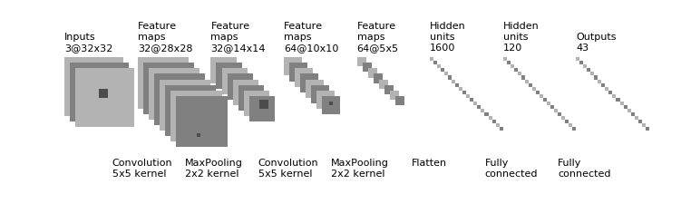
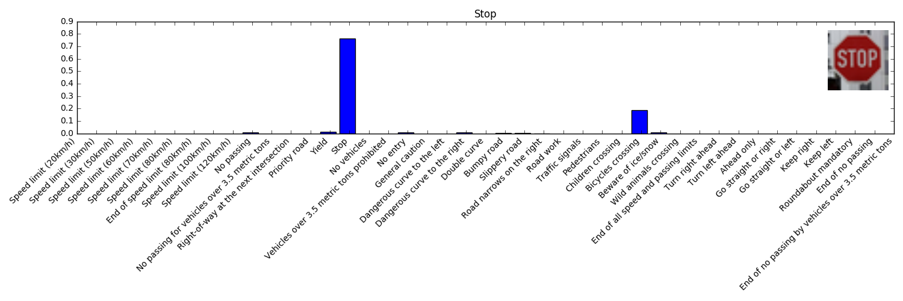
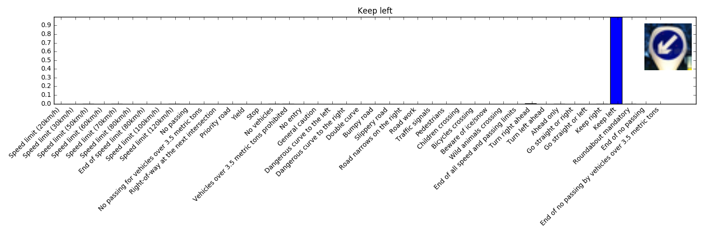

# Perception Algorithms for Self-driving Car

Perception related projects of Udacity's Self-driving Car Nanodegree Program. 
* [Lane Line Finding](./Lane-Line-Finding/)
* [Vehicle Detection](./Vehicle-Detection/)
* [Traffic Sign Classification](./Traffic-Sign-Classifier/)

asdfghjk

Summary
---
### Lane Line Finding
[Lane Line Finding](./Lane-Line-Finding/)에서는 Camera Calibration, Color Thresholding, Gradient Thresholding and Image Wraping등의 전통적인 Computer Vision 테크닉을 이용하여 Lane Line을 찾습니다. 영상에서 찾아진 Lane Line은 `Bird eye view`로 변환된 영상을 pixel 단위에서 meter 단위로 변환하여, 현재 차량의 `CTE(Cross Track Error)`, 도로의 `Curvature`을 구합니다.

  

### Vehicle Detection
[Vehicle Detection](./Vehicle-Detection/)에서는 Vehicle과 non-Vehicle을 구분할 수 있는 `SVM` Classifier를 학습시킨 뒤, `Sliding window` 방법을 이용하여 영상에서 차량의 위치를 검출합니다. Multi-detection과 False Positive 문제를 해결하기 위하여 이전 프레임 및 현재 프레임의 정보를 이용하여 `Heat-map`을 구축한 뒤 최종적으로 차량의 위치를 판단 할 수 있도록 알고리즘을 구성하였습니다.

  

### Traffic Sign Classification
[Traffic Sign Classification](./Traffic-Sign-Classifier/)에서는 CNN(Convolutional Neural Network)를 이용하여 43종류의 표지판을 구분해 내는 Classifier를 설계했습니다. [LeNet](http://yann.lecun.com/exdb/lenet/)을 Retrain시킨 결과, Test accuracy 93.5%로 43종류의 표지판을 구분해 낼 수 있었습니다.

  
  
  

