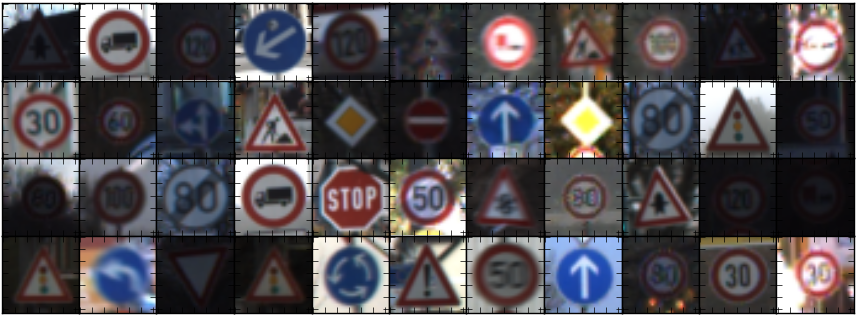
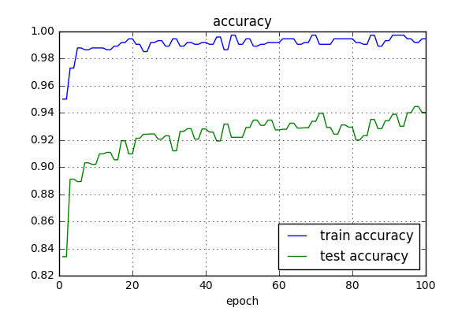
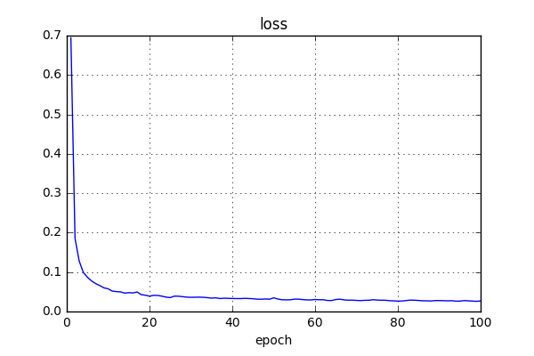
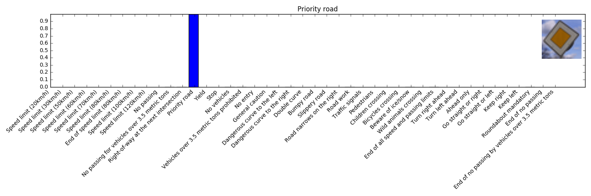
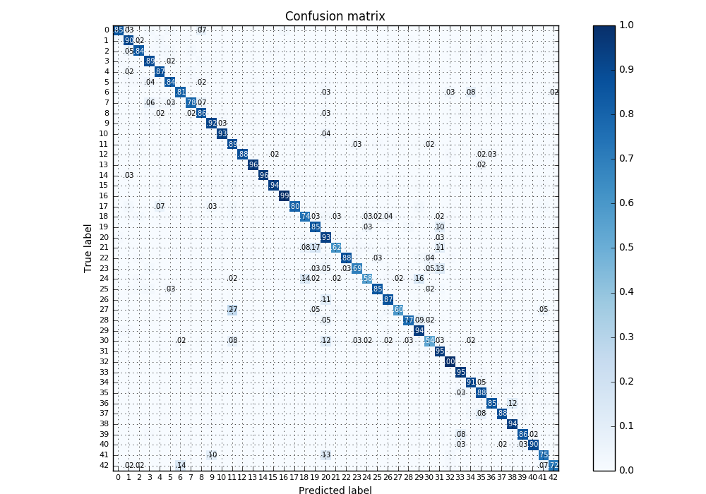

## LeNet Implementation for Traffic Sign Classification - Tensorflow

In this project, 독일에서 사용되는 43종류의 Traffic sign을 구분해 내는 것이 목표입니다. 이를 위해 [LeNet](http://yann.lecun.com/exdb/lenet/)의 Output layer의 수를 43개로 바꾼 뒤, Traffic Sign data를 이용하여 네트워크를 Retrain 시켰습니다.

Dataset
---

  

[German Traffic Sign Dataset](http://benchmark.ini.rub.de/?section=gtsrb&subsection=dataset)의 이미지들을 Training 및 Test에 이용합니다. Training/Test를 위한 Pickled dataset은 아래에서 받을 수 있습니다.

### Vanilla Pickled dataset 
* [Training data](https://www.dropbox.com/s/8ldwwtgp8n4owuv/train.p?dl=0) (102MB)
* [Validation data](https://www.dropbox.com/s/cs96orc7i3sfvr3/test.p?dl=0) (12.9MB)
* [Test data](https://www.dropbox.com/s/cs96orc7i3sfvr3/test.p?dl=0) (37MB)

### Augmented Pickled Dataset
* [Training data](https://www.dropbox.com/s/v09biif3epk922v/train_aug.p?dl=0) (431MB)

or you can download all data [`Traffic_Signs_data.zip`](https://www.dropbox.com/s/9qaiamsvzknhrvb/Traffic_Signs_data.zip?dl=0) (395MB)

Training
---

  

### Network
LeNet with `Batch Normalization` before each activation layer. No dropout! 

Convolutional weights were initialized by [`'He' method`](https://arxiv.org/abs/1502.01852).

### Environment
* Python 3.5.2
* Tensorflow 1.0.1

### Optimizer Settings
* Optimizer: `Adam`
* Learning rate: `10e-3`
* Loss: `Cross entropy`
* Batch Size: `1024`
* Epoch: `100`

Result
---
### Test Accuracy = 94.0%

  
  

### Inference using arbitrary traffic sign data

  
  
  

### Confusion Matrix

  

